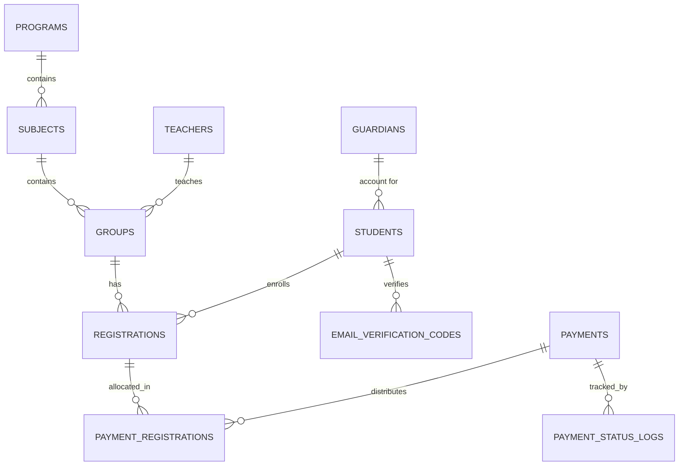

# برومت تنفيذ شامل: نظام إدارة أكاديمية التعليم الخصوصي

## السياق العام

نظام إدارة أكاديمية دروس خصوصية (برامج توجيهي، أطفال، تأهيلي) — **Laravel 12**، Blade + Alpine.js أو Livewire، Tailwind CSS، Laravel Queue للمهام المؤجلة (إيميلات، توليد PDF). هاد الملف هو المرجع الشامل والنهائي لكل الجداول والعلاقات والقواعد المتفق عليها — أي تفصيل هون يلغي/يحدّث أي نسخة سابقة.

## قبل البدء: افحص النظام الحالي

**لا تفترض قاعدة بيانات فاضية.** قبل أي Migration بالمرحلة 1، اعرض علي الحقول الموجودة فعلياً بالجداول الحالية بمشروعي (خصوصاً أي جدول قريب من `students`/`users`) — حتى نتأكد شو موجود أصلاً وشو ناقص، بدل ما تُنشئ جداول أو أعمدة مكررة أو متعارضة مع الموجود.

**الأسلوب البرمجي:** اتبع بالضبط نفس اللوجيك المستخدم بشاشة إدارة المستخدمين (Users) الموجودة عندي حالياً — نفس بنية الـ Controller، الـ Form Requests، تنظيم الـ Views، وطريقة التعامل مع الصلاحيات. اطلب مني كود هاي الشاشة كمرجع قبل ما تبلش أي مرحلة.

## معايير القبول — كل مرحلة لازم تحققها فعلياً، مش بس Scaffolding

- **الصلاحيات:** الأدوار المذكورة بالقواعد الحرجة (مالية، إدارة محتوى...) لازم تُنشأ وتُربط فعلياً بالـ Middleware/Policies، مش بس موصوفة نظرياً
- **الصور:** رفع صورة البرنامج وعرضها لازم يشتغل فعلياً من طرف لطرف (Upload → Storage → عرض بالواجهة)، مش Placeholder
- **بيانات حية من قاعدة البيانات:** شاشة تصفح البرامج والمواد التابعة لكل برنامج لازم تُجلب فعلياً بـ Eloquent من قاعدة البيانات — ولا بيانات ثابتة (hardcoded/mock) بأي شاشة نهائية
- **اختبار شامل:** بعد كل مرحلة، اكتب Feature Tests تغطي: الحالة الناجحة، حالات الفشل (validation)، الصلاحيات (مين مسموحله يوصل)، والعلاقات بين الجداول — مش بس اختبار سطحي إن الصفحة بترجع 200

---

## المخطط الكامل لقاعدة البيانات

| الجدول | الحقول الأساسية | ملاحظة |
|---|---|---|
| `programs` | name_ar, name_en, slug, image, type(عادي/أطفال/تأهيلي), short_description, long_description, sort_order, is_active | `type` يتحكم بمنطق لاحق (ولي أمر إلزامي) |
| `subjects` | program_id, name_ar, name_en, fee, min_payment, sort_order, is_active | `min_payment ≤ fee` إلزامي |
| `groups` | subject_id, teacher_id, name, schedule(days+time), max_capacity, is_active | السعة تحسب تسجيلات `pending` كمان |
| `students` | name, email, email_verified_at(nullable), guardian_id(nullable) | |
| `guardians` | name, email, phone | إلزامي لبرنامج نوع "تأهيلي" أو "أطفال" |
| `email_verification_codes` | student_id, code(مشفّر), attempts, expires_at | يُحذف/يُبطَل بعد الاستخدام |
| `registrations` | student_id, group_id, **fee_snapshot**, amount_paid, status(pending/partially_paid/fully_paid) | `fee_snapshot` لا يتغيّر أبداً بعد الإنشاء |
| `payments` | amount, method, receipt_image, status(pending/approved/rejected), invoice_number(تسلسلي، يُسند فقط عند الموافقة), reviewed_by, reviewed_at | |
| `payment_registrations` | payment_id, registration_id, allocated_amount | التوزيع التناسبي |
| `payment_status_logs` | payment_id, action, by, at, note | سجل تدقيق — من وافق/رفض ومتى وليش |

---

## القواعد الحرجة — لازم تُحترم بكل مرحلة

### أ) سلامة البيانات المالية
- `fee_snapshot` بجدول `registrations` **لا يتغيّر أبداً** حتى لو تغيّر `fee` بجدول `subjects` لاحقاً
- التوزيع التناسبي: آخر مادة بالتوزيع تاخذ **الباقي** (`المبلغ - مجموع ما تم توزيعه`) مش نصيبها المحسوب مباشرة، حتى يطابق المجموع تماماً بدون فرق تقريب
- ولا سجل مالي (`payments`, `registrations`) ينحذف نهائياً — `soft delete` فقط، وأي تصحيح بقيد عكسي مش تعديل مباشر

### ب) الأمان والصلاحيات
- كل عملية موافقة على دفعة تصير جوا `DB::transaction()` واحدة (توزيع + تحديث حالات + سجل تدقيق + إشعارات)
- Idempotency: تحقق من الحالة الحالية للدفعة قبل أي تحويل حالة (منع معالجة نفس الدفعة مرتين)
- دور "مالية" منفصل عن أدمن المحتوى العام (`spatie/laravel-permission`) — مو كل أدمن يوافق على دفعات
- أكواد التحقق مخزّنة مشفّرة (`Hash::make`)، بحد أقصى 5 محاولات، وصلاحية 5-10 دقايق
- ملفات الإيصالات والفواتير المولّدة تُخزَّن بـ `storage/private` مع Signed URLs، مش مسار عام
- كل الحماية الحقيقية Server-Side — المودال والواجهة تجربة استخدام بس، مش خط الدفاع

### ج) منطق العمل
- حجز السعة بالمجموعة يصير لحظة **إضافة الطلب للسلة/checkout**، مو لحظة تأكيد الدفع — فحساب السعة المتاحة لازم يشمل تسجيلات `pending`
- الإشعارات لازم تتحقق مين صاحب الحساب الفعلي (طالب أو guardian) قبل الإرسال
- تعديل `fee` على مادة عندها تسجيلات قائمة: التنبيه للأدمن إلزامي، بس **بدون** أي تأثير رجعي على التسجيلات الموجودة

### د) تجربة الإدارة
- برنامج/مادة/مجموعة فيها بيانات تابعة (تسجيلات، مواد، مجموعات) **ما تُحذف نهائياً** — تعطيل فقط، مع تحذير بعدد العناصر التابعة
- شاشات البرامج/المواد/المجموعات Nested Resources (`programs/{p}/subjects`, `subjects/{s}/groups`) مع Breadcrumbs، مو قوائم مسطحة منفصلة

---

## مسار العمل: 5 مراحل

### المرحلة 1 — قاعدة البيانات الكاملة
كل الـ Migrations بالترتيب: programs → subjects → groups → teachers → guardians → students → email_verification_codes → registrations → payments → payment_registrations → payment_status_logs. بعدها كل الـ Models والعلاقات (`hasMany`/`belongsTo`/`belongsToMany` حسب المخطط أعلاه) + Factories لكل جدول للاستخدام بالـ Tests لاحقاً.

### المرحلة 2 — التسجيل والتحقق من البريد
حساب طالب جديد → مودال تحقق فوري (6 خانات + عداد إعادة إرسال 60 ثانية) → Middleware يمنع وصول أي حساب غير مؤكد لشاشات تصفح البرامج → Scheduled Command يحذف الحسابات غير المؤكدة بعد 24-48 ساعة.

### المرحلة 3 — تصفح البرامج والتسجيل (السلة)
تصفح البرامج/المواد/المجموعات (عام) → إضافة للسلة (تحقق سعة + عدم تكرار تسجيل) → Checkout: إنشاء `registrations`(pending) مع `fee_snapshot` مجمّد + رفع دفعة → إنشاء `payments`(pending).

### المرحلة 4 — المحرك المالي والفواتير
موافقة/رفض الأدمن (دور مالية فقط) → عند الموافقة: توزيع تناسبي (`payment_registrations`) + تحديث حالة كل `registrations` (partially_paid/fully_paid حسب `min_payment`) + ترقيم فاتورة تسلسلي + توليد PDF (Job) + إشعار (Job) — الكل جوا Transaction واحد. كشف حساب حي لكل طالب (تقرير يُحسب من الجداول، مش جدول مخزّن).

### المرحلة 5 — شاشات إدارة المحتوى
CRUD كامل للبرامج والمواد والمجموعات، بالتدرّج الهرمي وBreadcrumbs، مع كل التحذيرات المذكورة بالقواعد الحرجة أعلاه (منع الحذف، تنبيه تعديل الرسوم، تحقق `min_payment ≤ fee`، تعارض جدول المعلم).

---

## تعليمات ختامية

ابدأ بالمرحلة 1 حصراً وخلصها بالكامل (Migrations + Models + Factories شغالة ومُختبرة) قبل الانتقال لأي مرحلة تانية — كل شي لاحق مبني عليها. اسألني عن أي قاعدة عمل غامضة قبل ما تبلش، ولا تفترض سلوك غير مذكور هون.
